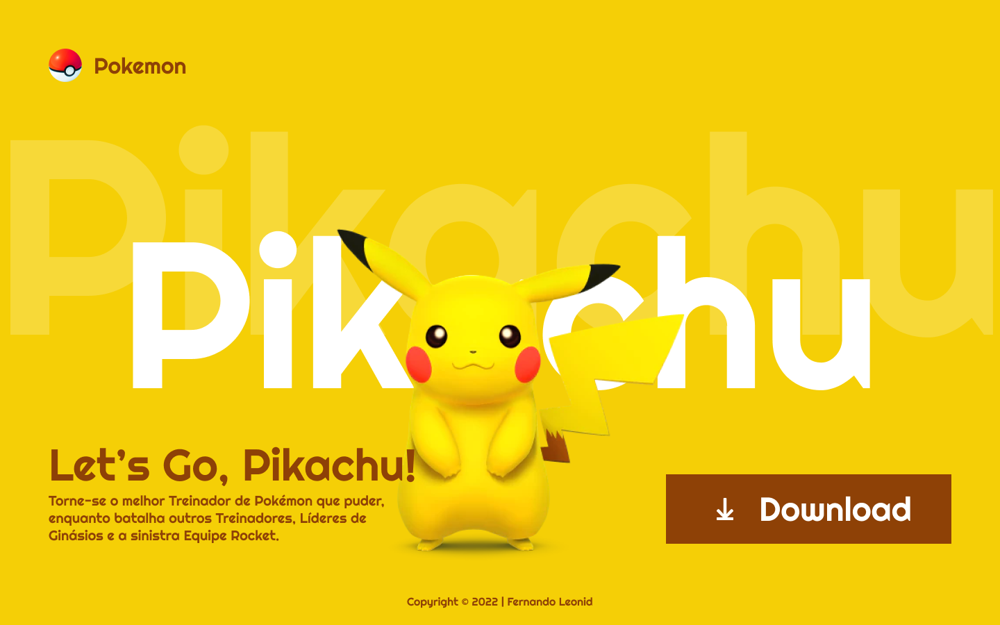

# **Landing Page - Pikachu**

Projeto realizado em **HTML** e **CSS**, sob as orientações do professor Fernando Leonid com base no projeto feito pelo [**FIGMA**](https://www.figma.com/file/KeKPzzFJTK7hrSb2SJ47W2/youtube--pikachu?node-id=0%3A1).

Responsividade para Tablet e Mobile.

Autora:
-
- [Yasmin Gonçalves.](https://yasmingcv.github.io/portfolio/)

Contato:
-
- [Instagram](https://www.instagram.com/yasmingcv/)
- [Linkedin](https://www.linkedin.com/in/yasmin-gon%C3%A7alves-023115246/)
- [WhatsApp](https://api.whatsapp.com/send?phone=5511948303519&text=Ol%C3%A1!%20Peguei%20seu%20n%C3%BAmero%20no%20GitHub!)